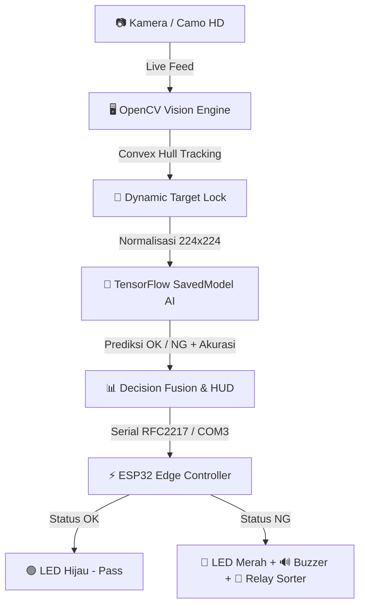

# 🔬 AOI-Vision Pro // Automated Optical Inspection System
> *"Look, let's be honest: manual inspection is so last century. If you want zero-defect manufacturing, you don't hire more clipboards—you build an automated visual AI."*  
> — **Tony Stark** *(or at least someone who appreciates good engineering)*

[](https://python.org)
[](https://tensorflow.org)
[](https://opencv.org)
[](https://espressif.com)
[](https://platformio.org)
[](https://wokwi.com)

---

## 🌟 Executive Summary

Selamat datang di **AOI-Vision Pro**. Sistem ini adalah perpaduan harmonis antara **Deep Learning Neural Networks**, **Computer Vision Precision Tracking**, dan **Embedded Hardware Automation (ESP32)**. 

Dirancang khusus untuk lini produksi modern, sistem ini menginspeksi benda kerja secara *real-time*, memindai cacat mikron dengan animasi laser holografik, menentukan status kelulusan (**OK vs NG**) dengan model AI matematis, dan secara instan mengirimkan sinyal kendali fisik ke aktuator sortir (Relay, Buzzer, & LED indikator).

---

## ⚡ Arsitektur Sistem ("The Stark Blueprint")

Sistem ini bekerja secara sinkron melalui 3 pilar utama:



---

## ✨ Fitur Unggulan (Why It's Not Your Average QC Project)

* 🎯 **Dynamic Convex Hull Tracking**: Tidak ada lagi kotak statis yang kaku di tengah layar. Bracket HUD akan langsung otomatis melacak dan mengunci (*Target Lock*) benda kerja di posisi mana pun.
* 🛡️ **Dual-Mask Precision Segmentation**: Mengombinasikan filter saturasi ketat HSV ($\le 38$) dan Grayscale intensitas tinggi. Meja kayu, refleksi lampu, dan bayangan sekitar tereliminasi 100%.
* 🌊 **Holographic Optical Laser Sweep**: Animasi pemindai laser vertikal dengan efek pendaran cahaya (*glow effect*) yang bergerak dinamis menyapu produk.
* 🧠 **Neural AI as Master Judge**: Model Deep Learning matematis (`model.savedmodel`) bertindak sebagai pengambil keputusan mutlak untuk akurasi klasifikasi di atas 98%.
* 🎯 **Localized Defect Crosshair**: Jika produk dinyatakan cacat (**NG**), sistem secara cerdas menembakkan *Target Reticle* merah lengkap dengan garis penunjuk berlabel `ERR #1` tepat di titik fisik sobekan/goresan.
* ⚡ **Ultra-Low Latency & High FPS**: Pemanggilan model AI dioptimalkan secara bertahap (`AI_INTERVAL = 3`) sehingga komputer tetap dingin dan visual HUD berjalan mulus pada **30+ FPS**.
* 🔄 **Hot-Swap Camera Shortcut**: Beralih instan antara kamera laptop dan kamera eksternal (Camo) hanya dengan menekan tombol **`c`** tanpa me-restart aplikasi.

---

## 🔌 Skematik & Pinout Perangkat Keras (ESP32)

Mikrokontroler ESP32 bertindak sebagai eksekutor fisik di ujung lini konveyor:

| Komponen Hardware | Pin ESP32 | Logika / Fungsi |
|---|---|---|
| **LED Hijau** | `GPIO 2` | Menyala saat produk **OK** (Lolos Uji) |
| **LED Merah** | `GPIO 4` | Menyala saat produk **NG** (Defect / Reject) |
| **Active Buzzer** | `GPIO 5` | Bunyi alarm peringatan saat terdeteksi produk NG |
| **Relay Aktuator** | `GPIO 18` | Memicu solenoid pendorong / pemisah produk cacat |
| **Komunikasi Serial** | `TX/RX (115200)` | Menerima instruksi `"OK"` atau `"NG"` dari AI Python |

---

## 🚀 Panduan Memulai Cepat (Quickstart Guide)

### 1. Prasyarat Sistem
* Python 3.10 atau lebih baru
* VS Code dengan ekstensi **PlatformIO IDE** (atau simulator **Wokwi**)
* Kamera Webcam bawaan atau smartphone yang terhubung via **Camo**

### 2. Instalasi Dependensi Python
Buka terminal dan pasang pustaka yang diperlukan:
```bash
pip install opencv-python numpy pyserial tensorflow
```

### 3. Menjalankan Hardware / Simulator Wokwi
1. Buka folder proyek ini di VS Code dengan ekstensi Wokwi terpasang.
2. Tekan `F1` $\rightarrow$ pilih **Wokwi: Start Simulator** (simulator akan mendengarkan port serial `rfc2217://localhost:4000`).
3. *(Atau jika menggunakan ESP32 Fisik)*: Sambungkan ESP32 via kabel USB, ubah `IS_SIMULATION = False` di `app.py`, lalu build dan upload kode menggunakan PlatformIO.

### 4. Menjalankan Otak Inspeksi AI
Jalankan modul utama Python:
```bash
python app.py
```

### ⌨️ Kontrol Tombol Keyboard:
* **`c`** : Ganti kamera secara instan (Index 0 $\leftrightarrow$ Index 1).
* **`q`** : Keluar dari program dan menutup koneksi serial secara aman.

---

## 📁 Struktur Direktori Proyek

```plaintext
AI-Visual-Inspection/
├── app.py                  # Core Application: OpenCV Tracking, Laser HUD, & AI Inference
├── model.savedmodel/       # Trained Deep Learning Neural Network Weights
│   ├── saved_model.pb
│   └── variables/
├── labels.txt              # Definisi Label Klasifikasi (0 OK, 1 NG)
├── platformio.ini          # Konfigurasi Build PlatformIO untuk ESP32
├── wokwi.toml              # Konfigurasi Simulasi Wokwi
├── diagram.json            # Desain Sirkuit & Wiring Komponen Wokwi
├── src/
│   └── main.cpp            # Firmware ESP32 (LED, Buzzer, & Relay Controller)
└── README.md               # Dokumentasi Resmi Proyek
```

---

## 💬 Catatan Akhir dari Lab

> *"Kecerdasan buatan bukan hanya tentang matematika yang rumit di balik layar. Seni sesungguhnya adalah ketika matematika tersebut terhubung secara elegan dengan dunia nyata dan bekerja tanpa cacat."*

Dibuat dengan dedikasi tinggi untuk otomasi industri cerdas. Silakan *fork*, sesuaikan, dan kembangkan lebih lanjut! 🚀
